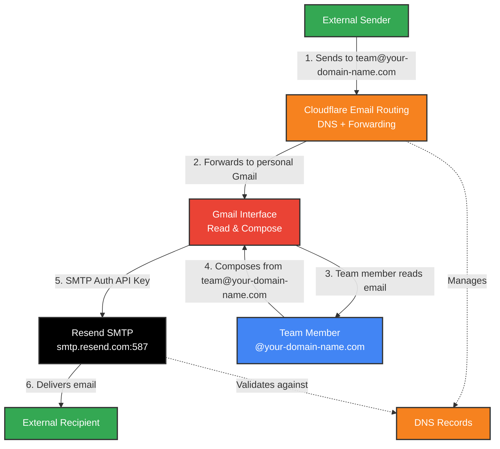

This marks my very first post on my very own, freshly-built website that I somehow put together thanks to the generosity of the the greatest collection of humans out there - the open source community. 

We're going to dive right in.
This is a practical 'tutorial'? (it isn't really, it's just a collection of thoughts I had as I went through the process for my team's email setup). 
The only caveat is that it isn't exactly 100% free. We (OCEAN AI) are early-career professionals so we're not exactly swimming in cash, but we *can* afford to buy a domain (in our case @ocean-ai-sey.com). So the only pre-requisite if you're trying to follow along is ownership of a domain. I've always used Cloudflare registrar to purchase mine just because they're a reputable company and there are security benefits you get on the free plan. There have been no issues, to date, but I'm also not outwardly endorsing Cloudflare. So not only would I recommend buying your own domain but I'd also recommend doing your research and weighing your options. There are loads of other providers to choose from, each with their own perks and pros and cons. 

So without further ado:

## THE PROBLEM STATEMENT
Following a conversation with someone who'd been around the NGO/Blue Economy/Climat Change for a while, I was inspired to reach out to embassies to enquire about funding opportunities in STEM and AI since that's what we're all about at OCEAN AI. But then I thought it would look so much more professional if we were sending emails from a custom domain. My reasoning was that an org looking to disburse funds would feel more at ease entrusting us with their money if we'd at least gone through the effort of presenting ourselves professionally. The only problem is that we didn't have a domain at the time and I didn't want to ask members to pay even 5 dollars out of pocket for Google Workspace, which would have easily covered several needs at once, including cloud storage, real-time collaboration, custom email addresses, etc. So the biggest constraint here is money. We had to do it for free. Luckily, that's entirely possible thanks to Resend and Cloudflare.

## THE SOLUTION
It works like this:

When an email sent to your custom email address e.g. "enquiries@ocean-ai-sey.com" is routed (forwarded) by Cloudflare to your personal email account. 

You might then type a response through your normal email client (by client I'm referring to the app, the software you use to write and send your email e.g. gmail, outlook, etc.) Once you hit send, Resend handles the delivery of your email FROM your custom address.

So then you reply from enquiries@ocean-ai-sey.com rather than islander123@gmail.com.

Et voilà! Free email routing to and from your personal email address, through Cloudflare (incoming) and Resend (outgoing) that makes you look like an absolute pro.

The image below is called a mermaid diagram and it illustrates the process as described above.

## THE METHOD
This is a no-code solution.
It's all clicks and tweaking settings.
But we'll be skipping some of the mundane setup instructions such as how to sign up to Cloudflare, how to buy a domain from their registrar service, and how to sign up to Resend. Everything else is covered below.

### CLOUDFLARE
1. Once you own the domain, you'll see it pop up in your dashboard. Click on it.