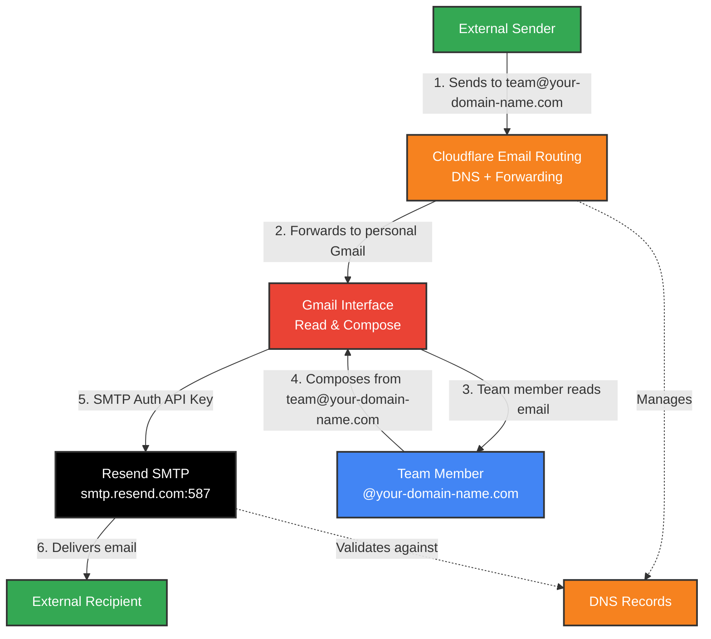

```mermaid
flowchart TD
    classDef cloudflare fill:#F6821F,stroke:#333,stroke-width:2px,color:#fff
    classDef resend fill:#000,stroke:#333,stroke-width:2px,color:#fff
    classDef gmail fill:#EA4335,stroke:#333,stroke-width:2px,color:#fff
    classDef user fill:#4285F4,stroke:#333,stroke-width:2px,color:#fff
    classDef external fill:#34A853,stroke:#333,stroke-width:2px,color:#fff

    %% Nodes
    EXT[External Sender]:::external
    CF[Cloudflare Email Routing<br/>DNS + Forwarding]:::cloudflare
    GMAIL[Gmail Interface<br/>Read & Compose]:::gmail
    RESEND[Resend SMTP<br/>smtp.resend.com:587]:::resend
    TEAM[Team Member<br/>@your-domain-name.com]:::user
    RECIPIENT[External Recipient]:::external

    %% Incoming Email Flow
    EXT -->|1. Sends to team@your-domain-name.com| CF
    CF -->|2. Forwards to personal Gmail| GMAIL
    GMAIL -->|3. Team member reads email| TEAM

    %% Outgoing Email Flow
    TEAM -->|4. Composes from team@your-domain-name.com| GMAIL
    GMAIL -->|5. SMTP Auth API Key| RESEND
    RESEND -->|6. Delivers email| RECIPIENT

    %% DNS Records
    DNS[DNS Records]:::cloudflare
    CF -.->|Manages| DNS
    RESEND -.->|Validates against| DNS
```